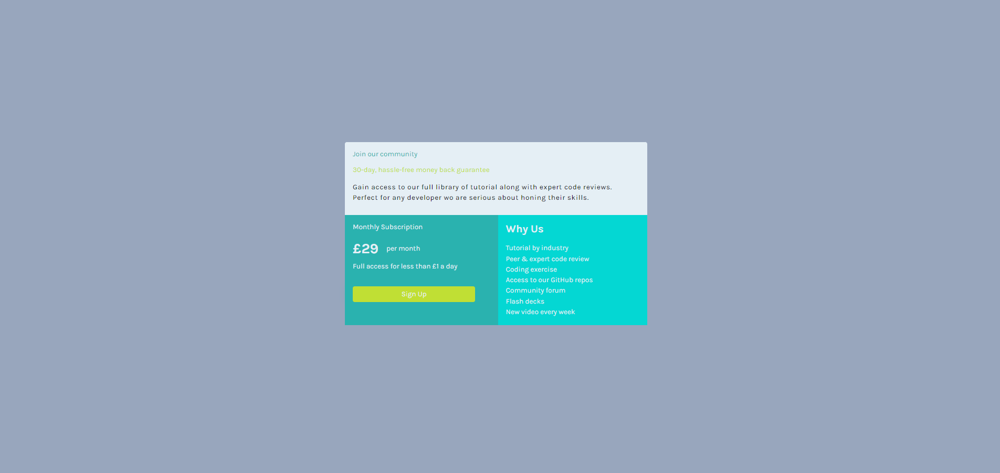

#SINGLE-PRICE-GRID-COMPONENT

## Table of contents

  - [Overview](#overview)
  - [The challenge](#the-challenge)
  - [Screenshot](#screenshot)
  - [Links](#links)
  - [My process](#my-process)
  - [Built with](#built-with)
  - [What I learned](#what-i-learned)

## Overview

In this project I build a single price component using grid .

## The challenge

Users should be able to:

- View the optimal layout for the component depending on their device's screen size

## Links
[CLLICK ME FOR LIVE VIEW](https://miron-silviu.github.io/single-price-grid-component/)

## Screenshot

## My process

In the first instance I builded the card in index.html and after that I style it in style.css

### Built with

- Semantic HTML5 markup
- CSS custom properties
- Flexbox
- CSS Grid
- Mobile-first workflow

## What I learned

I learned how to use semantic HTML and how to style using display grid .
